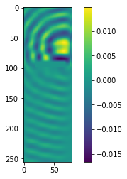
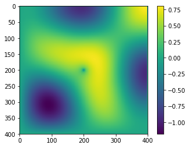

# 带有GPU加速的声场FDTD方法

[Github](https://github.com/ybw2016v/cuf/)

一个利用cuda加速python程序利用fdtd算法进行声场模拟的程序。计算结果用numpy数组格式保存。

基于python3和cuda，仅可在装备有NVIDIA显卡的计算机上使用。

## 文件结构

``` shell
../cuf
├── cufig.ini 主配置文件
├── cuf.py 主程序
├── initdog.py 初始文件生成脚本
├── LICENSE
├── README.md
├── res 计算结果保存位置
├── scr 
└── usercode.c 次配置文件
```
## 计算原理

以二维问题为例

描述声场变化的状态方程：

由伯努利方程可得
$$ \begin{cases}
\rho_{0} \frac{\partial \bm{v}}{\partial t}=-\nabla \cdot p \\
\frac{1}{c^{2}_{0}} \frac{\partial p}{\partial t}=-\rho_{0} \nabla  \cdot \bm{v}
\end{cases}$$

其中$\nabla$为微分算符。

将此方程组离散化处理


$$\begin{cases}
v_{x}^{T+1}=v_{x}^{T}-\frac{p(i)-p(i-1)}{m Z_{0}}  &(1)\\
v_{y}^{T+1}=v_{y}^{T}-\frac{p(j+1)-p(j)}{m Z_{0}}  &(2)\\
p^{T+1}=p^{T}-Z_{0} \frac{v_{x}(i+1)-v_{x}(i)+v_{y}(j)-v_{y}(j-1)}{m} &(3)
\end{cases}$$

其中$Z_{0}$为在点（i,j）处的$\rho_{0}$

m为$\frac{dx}{c\  dt}$dx为离散的空间间隔，dt为时间间隔，c为波速。

成功将微分方程转化为差分方程。

## 效果展示





## 使用方法

``` bash
./cuf.py -t 【计算模式】【配置文件】

```
默认配置文件为`cufig.ini`

计算模式目前有且仅有四种，分别为：

* 2d   普通二维模式
* 2dm  带有mur吸收边界的二维模式
* 3d   普通三维模式
* 3dm  带有mur吸收边界的三维模式

### 主要配置文件

``` ini
[计算规模]
长度 = 128
宽度 = 128
高度 = 128
；二维模式时此项不填
计算时间 = 10000
；计算的总时间步长
[初始值]
自动初值 = 是
；初始值的添加方式，自动初始值则全部清零。提供初始值的则在下面添加路径。
p0路径 = 
vx路径 =
vy路径 = 
vz路径 =
z0路径 = dogz.npy
；z0为必填项
m = 4
[中间过程]
添加方式 =./usercode.c
；次配置文件路径

[结果输出]
输出频率 = 1000
；输出的时间周期
输出路径 = ./res/
；输出的路径
```

### 次要配置文件

次要配置文件将在计算的准备阶段编译进计算主程序之中。配置错误将导致程序无法运行。

次要配置文件提供在每一步计算后，通过C语言对数据操作的能力，一般用于添加源或者其余条件。

二维模式下次要配置文件写法。
``` C
void usercode(float * p1,float * vx1,float * vy1,float *z0j,int xar, int yar,float m,int i)
{
    // 以下内容可以更改
    p1[4*xar+4*yar]=sin(0.1*i);
}

```

相关说明：

p1  : 指向计算过程之中的压强场指针

vx1 : 指向计算过程之中的x方向速度分量场
指针
vy1 : 指向计算过程之中的y方向速度分量场指针

z0j : 指向计算过程之中介质参数场指针

xar yar : 坐标索引。例：调用压强场的(a,b)点数据：p1[a\*xar+b\*yar]

m : m参数值

i : 时间，表示已经计算到第i步


三维模式下次要配置文件写法。

``` C
void usercode(float * p1,float * vx,float * vy,float * vz,float *z0,int xar,  int yar,int zar,float m,int i)
{
    // 以下内容可以更改
    p1[64*xar+64*yar+64*zar]=sin(0.1*i);
}
```

p1  : 指向计算过程之中的压强场指针

vx : 指向计算过程之中的x方向速度分量场指针

vy : 指向计算过程之中的y方向速度分量场指针

vz : 指向计算过程之中的z方向速度分量场指针

z0j : 指向计算过程之中介质参数场指针

xar yar 砸人: 坐标索引。例：调用压强场的(a,b，c)点数据：p1[a\*xar+b\*yar+c\*zar]

m : m参数值

i : 时间，表示已经计算到第i步

## 数组生成器

```bash
$./initdog.py --help
usage: initdog.py [-h] [-2d | -3d] [-name [NAME]] [-n [N]] x y [z]

NPY格式数组生成器
默认数值为1
例子：
生成一个2X3的名为“num”二维数组:
./initdog.py -2d -name num 2 3
生成一个2X3X4的数值为5.3的三维数组：
/initdog.py -3d -n 5.3 2 3 4

positional arguments:
  x             X轴
  y             Y轴
  z             Z轴

optional arguments:
  -h, --help    show this help message and exit
  -2d, --d2     二维
  -3d, --d3     三维
  -name [NAME]  输出文件名
  -n [N]        数值

```

## 相关依赖

* make
* nvcc
* argparse
* configparser
* numpy
* matplotlib
* progressbar

## 版本更新

1.0 原始版本
